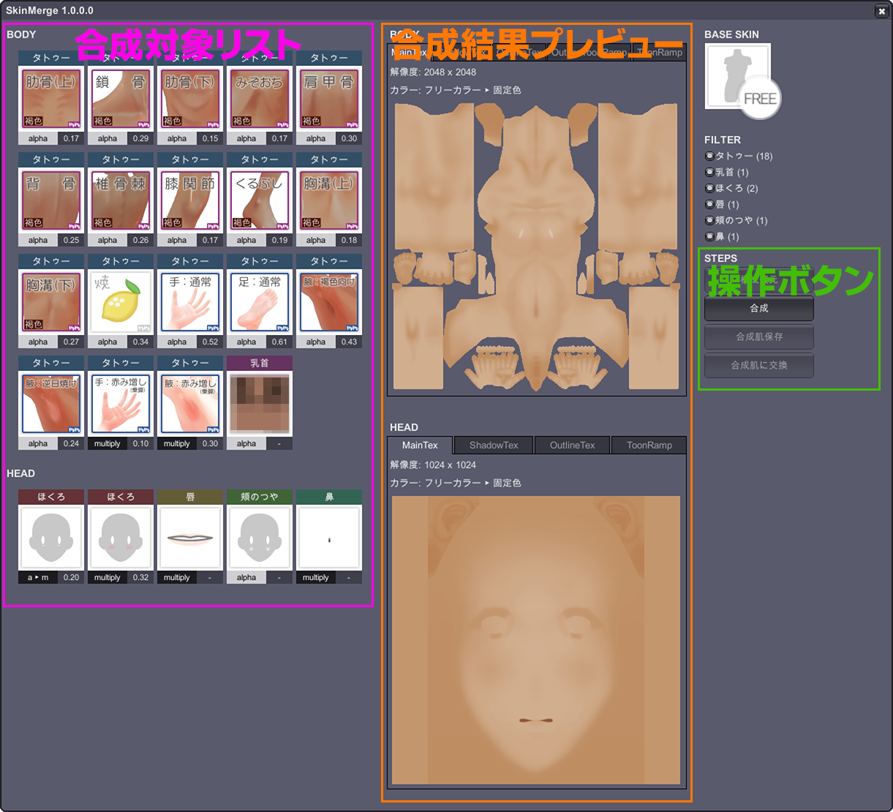
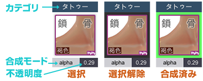
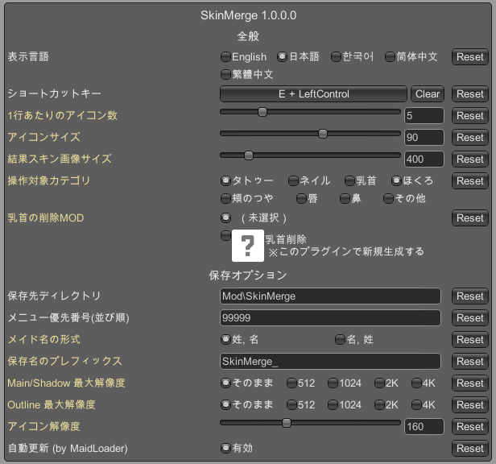



<!-- content begin -->

# 目次
 
- [概要](#概要)
- [動作条件](#動作条件)
- [導入方法](#導入方法)
- [使用方法](#使用方法)
- [合成仕様](#合成仕様)
- [設定変更](#設定変更)
- [翻訳](#翻訳)
- [注意事項](#注意事項) ⚠️重要な注意点があります。必ずお読みください。⚠️
- [利用規約](#利用規約)
- [ライセンス](#ライセンス)

# 概要

COM3D2用 肌MOD合成プラグインです。  
タトゥーやほくろをはじめとした肌に重ねて表示する仕様のカテゴリを合成し個別メイド専用の肌MODにまとめることでメモリ消費量を削減します。  
BepInEx用とSybaris用とありますが、BepInEx用を推奨します。(MaidLoaderとの連携・設定GUI等の利便性のため)  
次の状況の方におすすめです。(作者の状況そのまんまです)

- タトゥーを大量に重ねていてメモリ消費量が激しい
- シーンに複数人メイドが出ると動作が重くなる
- VRモードでWindowsデスクトップとフォーカス切り替えたりすると動作が重くなる
- 重くなるときはfpsが1桁レベルまで落ちて復活するのに数分かかる
- 自分で手動合成したMODを作るも、Photoshop/Gimp等では同一再現ができず確認が大変

# 動作条件

- COM3D2 専用 (2.5非対応)
- BepInEx または Sybaris 導入済み

# 導入方法

### 本プラグインインストール

- BepInEx版
  1. Releasesより最新のパッケージの `*-BepInEx.zip` をダウンロードしてください。
  2. zip解凍し、`COM3D2.SkinMerge.dll` を `BepInEx\plugins` フォルダに入れてください。
- Sybaris版
  1. Releasesより最新のパッケージの `*-Sybaris.zip` をダウンロードしてください。
  2. zip解凍し、`COM3D2.SkinMerge.dll` を `Sybaris\UnityInjector` フォルダに、`COM3D2.SkinMerge.Managed.dll`/`COM3D2.SkinMerge.Patcher.dll` を `Sybaris` フォルダに入れてください。

※BepInEx版・Sybaris版を両方とも導入しても片方しか動かないようになっておりますが、どちらか一方だけにしたほうが良いです。

### 推奨プラグイン
 
- BepInEx.ConfigurationManager (BepInEx版のみ)
    - `v1.0.2.0` より必須ではなくなりました。
    - 設定GUIでの設定が楽なので推奨します。
    - ~~BepinEx導入していれば大抵入ってる？~~ 入ってない方多いみたい。でも設定がその場で反映するし便利ですよ。そんな設定あったのっていう発見もあり。
- MaidLoader (BepInEx版のみ)
    - 合成MOD生成後に自動でMODリスト更新を行う機能を利用する場合に必要です。
    - 現在公開停止・・？
    - 入手できない場合の対処方法
        - 合成MODを**新規**生成した場合のみ、利用可能状態にするために下記いずれかで対応してください。
          - ModRefresh プラグインで手動更新する
          - COM3D2を再起動し、再度合成作業して保存する(既存MOD上書きならすぐ使えます)

※Sybaris版でMODを即時更新する方法はないかと思いますので、合成MODを**新規**生成した場合のみ下記の方法で対応してください。
- COM3D2を再起動し、再度合成作業して保存する(既存MOD上書きならすぐ使えます)

# 使用方法

対象メイドでエディットシーンに移動し 、操作GUIを表示します。操作GUIはエディットシーンでしか表示されません。
- デフォルトでは`Ctrl+E`キー
- こちらのギアアイコン  からでも表示できます。

操作GUIでの基本的な操作手順は以下の通りです。

### 初めて適用するメイドの場合

1. (適宜) 合成対象の選択・非選択
2. `合成`ボタンを押す
3. `合成肌保存`ボタンを押す
4. `合成肌に交換`ボタンを押す

### 既に合成肌を適用しているメイドの場合

1. `構成復元`ボタンを押す
2. (適宜) タトゥー構成内容の編集、合成対象の選択・非選択
3. `合成`ボタンを押す
4. `合成肌保存`ボタンを押す
5. `合成肌に交換`ボタンを押す

## 操作GUI上の各種説明

- 合成対象リストの操作（左ペイン）
  - ここに並ぶマージ対象アイテムは初期は全て選択状態（白枠）となっています
  - アイテムを押すと白枠が黒枠になり非選択状態となり、合成対象から外れます
  - アイコン周りの情報説明は下図のとおりです  
    
  - マウスオーバーするとツールチップで詳細情報が表示されます
  - GUI右側のフィルターを使うとここのリストをカテゴリでフィルターできます
  - 肌テクスチャとは関係ないマテリアル番号が指定されたMODは合成対象外となりここには表示されません
  - 赤面系や淫紋系など動的に変化させたいものなどは合成対象にせず他のプラグインで制御してください
- 合成結果プレビュー（中央ペイン）
  - 合成結果の肌テクスチャがプレビューされます
  - `合成`ボタンを押すとここに最新の合成結果が表示されます
  - ベース肌がフリーカラーの場合、合成結果は固定色になります
    - プレビューではカラーパレット設定が既に適用状態となっています
  - ベース肌の含むテクスチャ状況によりタブ構成が変わります。
    - 原則`Main` `Shadow` `Outline`の3つのテクスチャ確認ができます
    - `Main` `Shadow`が同一のテクスチャを共有している場合`Main/Shadow`タブで統合されます
    - フリーカラー対象テクスチャが他にもある場合、結果確認用のため追加タブが出ることがあります
- ベース肌情報（右ペイン上部）
  - 現在のベース肌メニューアイコンが表示されます
  - `合成`実行すると合成結果MOD用のアイコンが右側に表示されます
  - 合成結果MOD用のアイコンは現在のメイドアイコンが合成利用されます
- 合成対象カテゴリフィルタ（右ペイン中央）
  - 合成対象リストの絞り込み用です
  - 合成対象に含まれるカテゴリ別のアイテム数が括弧内に表示されます
  - 初期状態では`タトゥー` `ほくろ`のみがフィルタ対象となっていますが、設定で他のカテゴリも追加できます
- 操作手順別ボタンリスト（右ペイン下部）
  - 各操作手順の順番に操作ボタンが並びます
  - 各ボタンにマウスカーソルを合わせるとツールチップで説明が表示されます
  - 各種ボタン
    - 構成復元
      - 既に合成肌を適用しているメイドの場合、元の構成に戻します
      - 個別タトゥーの濃さを調整するなど再編集する場合に使用してください
      - メモリ消費量にご注意ください
      - 合成肌を適用していないメイドの場合は無効化されています
    - 合成
      - 現在の選択状態に基づき合成を実行します
      - 合成結果プレビューが更新されます
    - 合成を戻す
      - 現在の合成結果を破棄し、合成前状態に戻します
    - 合成肌保存
      - 合成結果をMODとして保存します
      - 保存先やファイル名の形式などは確認ダイアログまたは設定で変更できます 
      - 保存後に自動でMaidLoaderのMODリスト更新を行うこともできます (MaidLoaderが必要)
    - 合成肌に交換
      - 生成した合成肌MODにメイドの肌を切り替えます
      - 合成に利用したアイテムは全て外れます
      - 交換を取り消したい場合は「構成復元」を使用してください

## 操作デモ

https://github.com/user-attachments/assets/5cc14179-adf6-4573-b839-2307627e7ac6

# 合成仕様

COM3D2の実際のレンダリング仕様に忠実に合わせることを目指した仕様となっています。  
合成に利用したMODの作り次第で制作者の意図してないであろう挙動があり、残念ながらその挙動を再現する方針としています。

- 原則、BODY/HEAD別にレイヤー昇順・追加順で合成する
- タトゥーカテゴリでは、レイヤー1～3以外のMODはレイヤー1扱いとなっており、それに準拠
  - (参考) 乳首カテゴリはレイヤー10となり一番最後に合成される
- ほくろカテゴリでは、レイヤー1以外のMODはレイヤー1扱いとなっており、それに準拠
- 同一レイヤー内にalpha/multiplyが混在している場合は最後に追加された合成モードに統一される扱いとなっており、それに準拠
  - 合成対象アイテムのアイコン下部に"m ▶ a"などの表記がある場合、単体ではmultiply指定であるものの後続の影響でalpha扱いとなるという意味を示しています。
  - ※特にHEADはレイヤーが1つしかないため、この仕様にかなり左右されます
  - ※タトゥーカテゴリでのmultipy指定MODはレイヤー2で作るのが定石となっているようです
- カテゴリ名accTatooの書き間違いacctatooとなっているMODは不透明度1.0固定扱いとなっており、それに準拠
  - 合成対象アイテムのアイコン下部に"0.5▶1.0"などの表記がある場合、不透明度0.5を指定しているが1.0に強制変更扱いという意味を示しています。
- ベース肌MODに口の中等の合成対象外のマテリアルテクスチャ変更が含まれている場合、生成MODにもそれを踏襲するようにしています。

# 設定変更

`F1`キーで表示されるBepInEx設定GUIにて各種設定が可能です。(BepInEx版かつConfigurationManager導入時のみ)
- (BepInEx): 設定内容は`BepInEx\config\SkinMerge.cfg` に保存されます。こちらのファイルを直接編集もできますが、GUIでの変更をおすすめします。
- (Sybaris): 設定内容は`Sybaris\UnityInjector\config\SkinMerge.cfg` に保存されます。GUIはなく直接編集しか方法はありません。

### 全般

- 表示言語
    - 操作GUI, 設定GUIの言語を変えます。設定GUIの一部は再起動しないと反映されないものがあります。
    - 翻訳追加については[こちら](#翻訳)
- ショートカットキー
    - 操作GUIの表示切り替えキー。デフォルトは`Ctrl+E`です。(PhotoShopのレイヤー統合ショートカットキーと同じ)
- 1行あたりのアイコン数
    - 操作GUI上のマージ対象リソースリストの1行あたりの表示数。
- アイコンサイズ
    - 操作GUI上のマージ対象リソースアイテムアイコンの表示解像度。
- 結果スキン画像サイズ
    - マージ結果スキンテクスチャの操作GUI上の表示解像度。
- 操作対象カテゴリ
    - 操作GUI上のマージ対象カテゴリの絞り込みに使うカテゴリリスト。
    - 合成には使うことはないカテゴリはここで外しておくといいです。デフォルトは「タトゥー」「ほくろ」のみ。
- 乳首の削除MOD
    - 公式では乳首カテゴリの未選択メニューは存在しません。乳首カテゴリを合成対象とするなら削除MODを選択する必要があります。既に該当MODを持っていればここで選択してください。なければこのプラグインで生成もできます。
        - なんらかの削除MODをお持ちの場合、自動的にこの選択肢に表示されます。
        - お持ちの削除MODで条件を満たせてないものがあるかもしれません。タトゥー型だけでなく公式型も消せる必要があります。よく分からなければこの機能で生成することをおすすめします。
    - 生成する場合
        - ハテナマークのアイコンを選択すると生成され選択状態になります。
        - 後述のMaidLoader自動更新が使えない場合は再起動が必要です。

### 保存オプション

- 保存ディレクトリ
    - 合成MODの保存先を指定します。合成MODをすぐに装着するにはmod配下に生成されるようにしておく必要があります。
    - デフォルトは `mod\SkinMerge\`。
- メニュー優先番号(並び順)
    - 合成MODのゲーム内メニューでの並び順を数値で指定します。デフォルトは`99999`で、なるべく最後に出現するようにしています。
- メイド名の形式
    - 合成MODのファイル名に入るメイド名の姓名順を指定します。
- 保存名のプレフィックス
    - 合成MODのファイル名およびフォルダ名の接頭辞
- Main/Shadow 最大解像度
    - 結果肌メインテクスチャの出力解像度。意図的に低解像度指定する必要がなければ`そのまま`を推奨します。
    - `そのまま`の場合、BODY/HEAD別にベース肌テクスチャ・合成対象の最大解像度で結果テクスチャが作られます。
- Outline 最大解像度
    - 結果肌アウトラインテクスチャの出力解像度。アニメ調セルルックの線用なので低解像度にするとサイズメリットあるかと思います。
    - デフォルトは`そのまま`としておりますが、`512`をおすすめします。
- アイコン解像度
    - メニューアイコンの解像度。公式は`90`ですがきれいに表示したいなら適宜上げてください。
    - 合成MODを生成後に変更しても反映されません。再生成が必要です。
- 自動更新 (by MaidLoader)
    - 合成MOD生成後に装着したい場合、MaidLoaderがあれば自動でMODリスト更新ができます。
    - MaidLoaderがないと有効にできません。

# 翻訳

`Bepinex\configs\MergeSkin` 以下に翻訳ファイルがあります。（一度起動すると自動的に作られます。）

- ここに他の言語ファイルを追加すれば読み込んで動作します。
- 翻訳を追加したい場合はいずれかjsonファイルをコピーして別言語に書き換えてください。
- できあがった翻訳ファイルはよろしければプルリクエストなり何らかの形で提供していただければ取り込みさせていただきます。
- もしくはこの言語が欲しいとリクエストしていただければ、AIによる翻訳になりますが追加させていただきます。
- 既存の翻訳でおかしいものがあれば修正リクエストしていただければ対応いたします。
- プラグインのバージョンアップに翻訳修正が含まれる場合、このフォルダ内の翻訳ファイルは一度消さないと反映できないかもしれません。

# 注意事項

### **⚠️生成MODの配布厳禁⚠️**

- 本プラグインを利用して合成生成されたMODは公式・非公式関わらず合成対象全ての著作権を含む生成物となります。
- パフォーマンス改善目的の個人利用に留め、絶対に配布しないようご注意願います。
- 合成対象が全てご自分の作られたMODである場合はその限りではありません。

# 利用規約

### KISSからのお願い

> ※MODはKISSサポート対象外です。  
> ※MODを利用するに当たり、問題が発生してもKISSは一切の責任を負いかねます。  
> ※「カスタムメイド3D2」又は「カスタムオーダーメイド3D2」を購入されている方のみが利用できます。  
> ※「カスタムメイド3D2」又は「カスタムオーダーメイド3D2」上で表示する目的以外の利用は禁止します。  
> ※これらの事項は http://kisskiss.tv/kiss/diary.php?no=558 を優先します。

### 作者からのお願い

- 本プラグインを利用して発生したいかなる問題に対しても、作者は一切の責任を負いかねます。
- バックアップ等を充分に行い、自己責任でご利用ください。
- 生成したMODの配布は禁止します。(上記[注意事項](#注意事項)参照)
- 本プラグインの改変は自由に行っていただいて構いませんが、改変物および再配布されたものに関して作者は一切の責任を負いかねます。
- バグ報告や修正プルリクエスト等は歓迎いたします。可能な限り対応いたします。下記までご連絡ください。  
  - [COM3D2.SkinMerge Github Issues](https://github.com/mmt3d/COM3D2.SkinMerge/issues)
  - [X: @momo3d2](https://x.com/momo3d2)

# ライセンス

- 本ソフトウェアはMIT Licenseです。
- 流用したいコードがあれば部分的にコピーして転用してもらって構いません。自己責任でお願いいたします。
